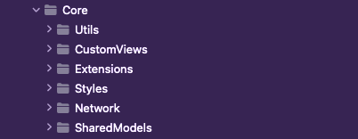

# KiliaroTest

This is a test project for [Kiliaro](https://kiliaro.com/) Team.

## Language and Frameworks
- Swift
- SwiftUI

## Project Structure
- DDD
- Package by feature

## Used Design patterns
- [MVVM](https://medium.com/ios-os-x-development/ios-architecture-patterns-ecba4c38de52)
- [Clean Architecture](https://www.youtube.com/watch?v=7EmboKQH8lM)
- Observable Pattern
- Repository Pattern
- Singleton

## App Packages

in this project we create our structure based on [clean Architecture](https://www.youtube.com/watch?v=7EmboKQH8lM) and DDD. so we packaged our app based on feature.(package feature)

in this project we have 5 main package or directory:
- [App](https://github.com/MarsXan/KiliaroTest/tree/main/KiliaroTest/App)

in this package we put all `Constant files` like `constant.swift`

- [Core](https://github.com/MarsXan/KiliaroTest/tree/main/KiliaroTest/Core)

In this package, we keep all shared files used by the features.

the `core` contains: 

| Directory        | Usage           |
| ------------- |:-------------:|
| [Utils](https://github.com/MarsXan/KiliaroTest/tree/main/KiliaroTest/Core/Utils)      |  directory of common utils like DatetimeUtil |
| [CustomViews](https://github.com/MarsXan/KiliaroTest/tree/main/KiliaroTest/Core/CustomViews)      | custom views that are not exit in UIKit and SwiftUI and can be reused      |
| [Extensions](https://github.com/MarsXan/KiliaroTest/tree/main/KiliaroTest/Core/Extensions) | useful functions that added to views and classes      |
| [Styles](https://github.com/MarsXan/KiliaroTest/tree/main/KiliaroTest/Core/Styles) | custom colors and font and dimensions are declared here      |
| [Network](https://github.com/MarsXan/KiliaroTest/tree/main/KiliaroTest/Core/Network) | engine and models of network is implemented in here.      |
| [SharedModels](https://github.com/MarsXan/KiliaroTest/tree/main/KiliaroTest/Core/SharedModels) | all models that are shared between feature are here      |

- [SupportingFiles](https://github.com/MarsXan/KiliaroTest/tree/main/KiliaroTest/SupportingFiles)

this package contains all the files that are generated by Xcode and assets

- [Presentation](https://github.com/MarsXan/KiliaroTest/tree/main/KiliaroTest/Presentation)

this directory is contains all the features(domain) that we defined in business.

all the feature in this directory are independent and absolute.

each feature has its files like ViewModel, models, views, API, and ...

we can easily delete and add features to this package without any complaints by other features.
    

## Other Key Points

- [Central Error handler](https://github.com/MarsXan/KiliaroTest/blob/main/KiliaroTest/Core/Utils/ErrorUtil.swift)
- [Central Network handler](https://github.com/MarsXan/KiliaroTest/blob/main/KiliaroTest/Core/Network/NetworkAgent.swift)
- Dark Mode Support
- [Central State Handler](https://github.com/MarsXan/KiliaroTest/blob/main/KiliaroTest/Core/SharedModels/KiliaroState.swift)

### States

| Empty        | Error           | Loading           |
| ------------- |:-------------:|:-------------:|
|       |    |    | 

- Preview for all View

